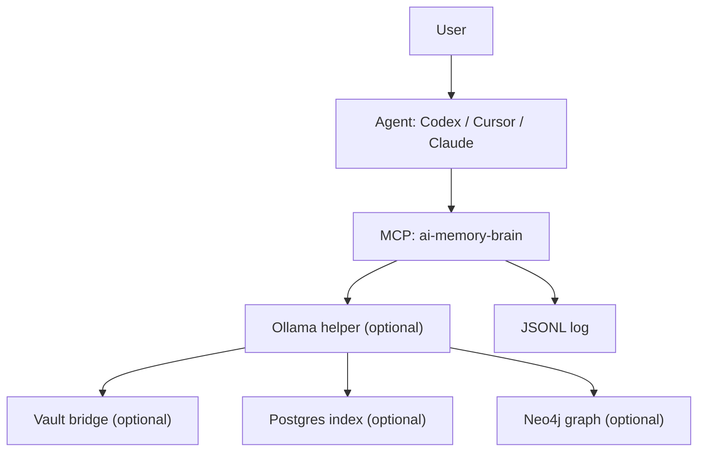
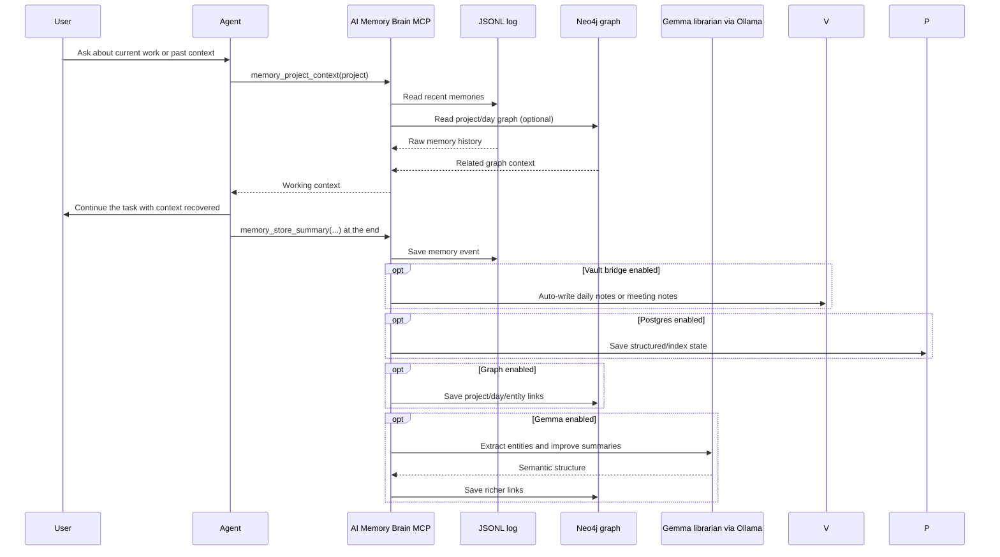
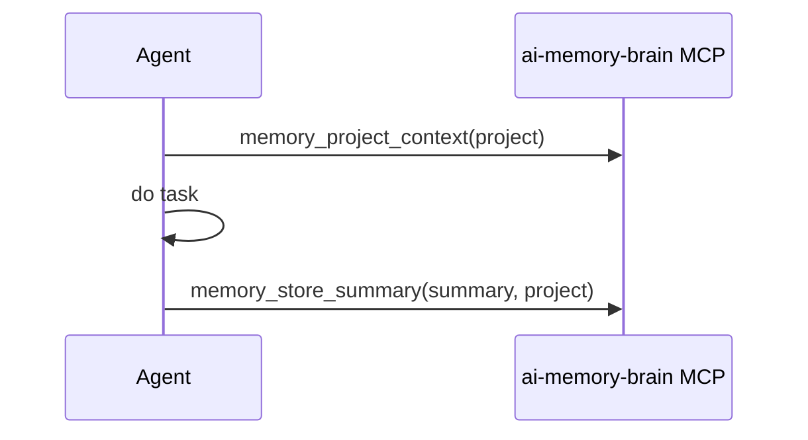
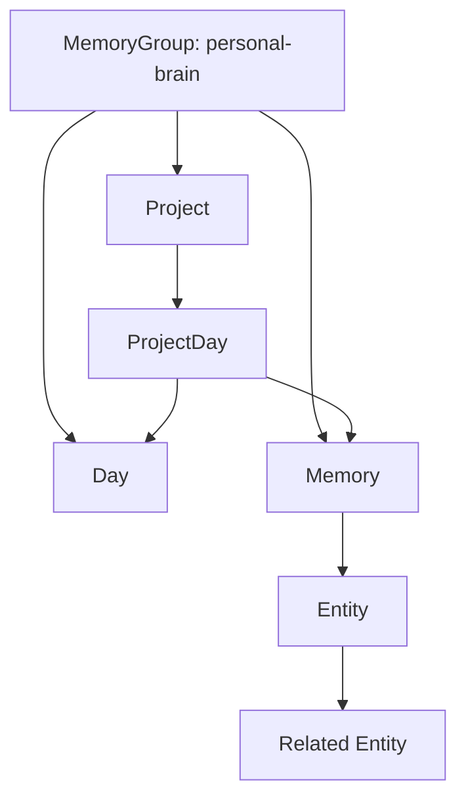

# AI Memory Brain

AI Memory Brain is a local memory layer for coding agents. It captures high-signal work context, stores it on your machine, and makes it queryable later through MCP tools.

It is not a replacement for a wiki. A wiki is where you publish curated knowledge. AI Memory Brain is where agents recover operational memory: what happened, why decisions were made, what changed, and what was already tried.

## Why use it
- Recover project context across sessions without re-explaining everything
- Answer questions like “what did we do yesterday?” or “why did we change this?”
- Keep memory local: JSONL storage, optional Neo4j graph, optional Ollama helper
- Work across projects and agents instead of per-repo notes

## Best fit
Use AI Memory Brain when you want your agent to remember work history and decisions automatically or semi-automatically.

Use a wiki or Obsidian when you want polished, hand-curated documentation for humans.

The two work well together:
- Wiki/Obsidian = published knowledge
- AI Memory Brain = captured work memory

The graph is important because it turns memory from a flat event log into connected context. Instead of only storing entries by time, the graph links work by project, day, entity, and relationship so agents can recover why something mattered, not just that it happened.

Gemma and the graph are both optional, but both are recommended:
- Graph: makes recall structured instead of flat, so project/day/entity relationships stay connected
- Gemma librarian: improves extraction, summaries, and semantic links inside the graph

## What it includes
- `memory_librarian/server.py`: MCP stdio server with memory tools
- `memory_gateway/`: optional HTTP gateway and CLI helpers for auto-capture
- Local JSONL memory log
- Obsidian-compatible vault scaffold stored beside the memory log
- First vault bridge behavior for safe defaults:
  - daily check-ins/checkouts auto-write into `vault/daily-notes/`
  - `meeting_summary` events auto-write into `vault/meetings/`
  - project/people/reference knowledge starts in `vault/memory/review/`
- Install profiles: `simple`, `recommended`, `power-user`
- Optional but recommended Neo4j graph for project/day/entity relationships
- Optional Ollama helper for local extraction and summarization
- Optional but recommended Gemma librarian model for much better local entity extraction, summarization, and richer graph links

## Architecture


## How it works


## Installation

### Default app home
macOS default:

```bash
~/Library/Application\ Support/ai-memory-brain/
```

Default layout:
- `memory/events.jsonl`
- `memory/logs/`
- `vault/`
- `config/`

Current bridge behavior:
- `daily_checkin` and `daily_checkout` append into `vault/daily-notes/YYYY-MM-DD.md`
- `meeting_summary` writes a note into `vault/meetings/`
- review-first knowledge candidates are written into `vault/memory/review/`

### 1. Clone and set up Python
```bash
git clone https://github.com/akushniruk/ai-memory-brain.git
cd ai-memory-brain
python3 -m venv .venv-memory
source .venv-memory/bin/activate
pip install -r memory_librarian/requirements.txt
cp memory_gateway/.env.example memory_gateway/.env
```

### 2. Start with MCP-only mode
This is the simplest setup and the recommended starting point.

Profile mapping:
- `simple`: MCP + JSONL + vault scaffold
- `recommended`: `simple` + Postgres structured/index layer
- `power-user`: `recommended` + Neo4j graph + Ollama/Gemma librarian

Run the MCP server:
```bash
source .venv-memory/bin/activate
python memory_librarian/server.py
```

### 3. Connect your agent
Add an MCP server entry that points to `memory_librarian/server.py`.

Cursor example:

`~/.cursor/mcp.json`
```json
{
  "mcpServers": {
    "ai-memory-brain": {
      "command": "python3",
      "args": ["/absolute/path/to/ai-memory-brain/memory_librarian/server.py"]
    }
  }
}
```

For Codex or Claude, add the same MCP server entry in their MCP config.

## Full setup: recommended stack
This is the full setup I recommend and personally use when I want the best experience:
- MCP server for agent access
- Neo4j graph for connected memory
- Ollama running locally
- Gemma librarian model for extraction and better summaries

Why this setup is better:
- JSONL gives you the raw durable log
- Postgres gives you structured/index state without sitting on the hot path
- the graph makes memory navigable by project, day, entity, and relationship
- Gemma makes the graph much more useful by extracting better structure from what happened
- agents get both factual history and connected context

### Full stack prerequisites
- Python 3
- Neo4j running locally on `bolt://localhost:7687`
- Ollama running locally on `http://127.0.0.1:11434`
- A local Gemma model in Ollama, for example `gemma4:e2b`

### Full stack install
```bash
git clone https://github.com/akushniruk/ai-memory-brain.git
cd ai-memory-brain
python3 -m venv .venv-memory
source .venv-memory/bin/activate
pip install -r memory_librarian/requirements.txt
cp memory_gateway/.env.example memory_gateway/.env
```

### Full stack `.env`
Set `memory_gateway/.env` like this:

```dotenv
AI_MEMORY_BRAIN_HOME=~/Library/Application Support/ai-memory-brain
AI_MEMORY_INSTALL_PROFILE=power-user
MEMORY_SERVER_HOST=127.0.0.1
MEMORY_SERVER_PORT=8765
MEMORY_GROUP_ID=personal-brain
MEMORY_LOG_PATH=~/Library/Application Support/ai-memory-brain/memory/events.jsonl
VAULT_PATH=~/Library/Application Support/ai-memory-brain/vault
POSTGRES_DSN=postgresql://localhost/ai_memory_brain
NEO4J_URI=bolt://localhost:7687
NEO4J_USER=neo4j
NEO4J_PASSWORD=your-password
MEMORY_HELPER_ENABLED=1
MEMORY_HELPER_MODEL=gemma4:e2b
MEMORY_HELPER_BASE_URL=http://127.0.0.1:11434/api/generate
MEMORY_HELPER_TIMEOUT_SEC=15
```

### Start the full stack
1. Start Neo4j
2. Start Ollama
3. Make sure the Gemma model is available in Ollama
4. Start the memory gateway
5. Connect your agent to the MCP server

Example:
```bash
source .venv-memory/bin/activate
python memory_librarian/server.py
```

Optional gateway for auto-capture:
```bash
source .venv-memory/bin/activate
memory_gateway/start-server.sh
```

### Verify the full stack
Check the MCP server:
```bash
source .venv-memory/bin/activate
printf '%s\n%s\n' \
  '{"jsonrpc":"2.0","id":1,"method":"initialize","params":{"protocolVersion":"2025-11-25","capabilities":{},"clientInfo":{"name":"test","version":"0.0.1"}}}' \
  '{"jsonrpc":"2.0","id":2,"method":"tools/list","params":{}}' \
  | python memory_librarian/server.py
```

Check the memory gateway:
```bash
curl http://127.0.0.1:8765/health
```

Check Ollama:
```bash
curl http://127.0.0.1:11434/api/tags
```

Check Neo4j:
```cypher
MATCH (g:MemoryGroup)-[:HAS_MEMORY]->(m:Memory)
RETURN m.created_at, m.source, m.kind, m.text
ORDER BY m.created_at DESC
LIMIT 20;
```

### Agent prompt for the full stack
If your friend wants an agent to install the full setup, send this:

```text
Install AI Memory Brain for me with the full recommended setup.

Repo: https://github.com/akushniruk/ai-memory-brain

I want:
- MCP server enabled
- Neo4j graph enabled
- Ollama enabled
- Gemma as the librarian model

Please:
1. Clone the repo
2. Create and activate the Python virtualenv
3. Install requirements
4. Copy and configure memory_gateway/.env
5. Point Neo4j to my local instance
6. Configure Ollama at 127.0.0.1:11434
7. Use Gemma as the memory librarian model
8. Add the MCP server config for my agent
9. Verify MCP, gateway, Ollama, and Neo4j connectivity
10. Tell me exactly what you changed and how to run it daily
```

## Install it with an agent
If your friend wants an agent to do most of the setup, send this prompt:

```text
Install AI Memory Brain for me in MCP-only mode.

Repo: https://github.com/akushniruk/ai-memory-brain

Please:
1. Clone the repo
2. Create and activate a Python virtualenv
3. Install requirements from memory_librarian/requirements.txt
4. Copy memory_gateway/.env.example to memory_gateway/.env
5. Add the MCP server config for my agent
6. Run a smoke test by starting memory_librarian/server.py
7. Tell me exactly what you changed and how to verify it

Do not enable gateway mode or CLI wrappers unless I ask.
```

If they want auto-capture later, they can ask their agent to enable gateway mode after MCP-only is working.

## Copy-paste for an agent
Use one of these prompts exactly as-is.

### Copy-paste: simple install
```text
Install AI Memory Brain for me in MCP-only mode.

Repo: https://github.com/akushniruk/ai-memory-brain

Goal:
- local memory for my coding agent
- no cloud dependency
- simplest stable setup first

Please do the following:
1. Clone the repo
2. Create and activate a Python virtualenv
3. Install requirements from memory_librarian/requirements.txt
4. Copy memory_gateway/.env.example to memory_gateway/.env
5. Add the MCP server config for my agent
6. Run a smoke test for memory_librarian/server.py
7. Tell me exactly what changed, where the MCP config was added, and how to verify it later

Important:
- Do not enable gateway mode unless I ask
- Do not enable CLI wrappers unless I ask
- Keep the setup local and simple
```

### Copy-paste: full recommended install
```text
Install AI Memory Brain for me with the full recommended setup.

Repo: https://github.com/akushniruk/ai-memory-brain

I want this exact architecture:
- MCP server for agent access
- JSONL memory log
- Neo4j graph enabled
- Ollama running locally
- Gemma as the librarian model

Please do the following:
1. Clone the repo
2. Create and activate the Python virtualenv
3. Install the Python requirements
4. Copy and configure memory_gateway/.env
5. Configure Neo4j for the graph
6. Configure Ollama on 127.0.0.1:11434
7. Configure Gemma as the librarian model
8. Add the MCP server config for my agent
9. Verify MCP, gateway, Ollama, and Neo4j connectivity
10. Explain how to run and verify the setup daily

Important:
- Gemma is optional but recommended
- the graph is optional but recommended
- use placeholder secrets where needed and tell me what I still need to fill in
- tell me exactly what files you changed
```

## Recommended usage pattern


Good default workflow for agents:
- Start: `memory_project_context(project)`
- During work: `memory_search(...)` or `memory_by_date(...)` as needed
- End: `memory_store_summary(...)` with goal, changes, decisions, validation, and risks/TODO

## Core tools
- `memory_add`
- `memory_store_summary`
- `memory_search`
- `memory_recent`
- `memory_by_date` / `memory_get_date`
- `memory_project_context`
- `memory_daily_summary`
- `memory_today_summary`
- `memory_entity_context`
- `memory_graph_overview`
- `memory_graph_project_day`
- `memory_today_graph`
- `memory_brain_health`
- `memory_repair_graph`

## Verification
Check that the MCP server starts:
```bash
source .venv-memory/bin/activate
printf '%s\n%s\n' \
  '{"jsonrpc":"2.0","id":1,"method":"initialize","params":{"protocolVersion":"2025-11-25","capabilities":{},"clientInfo":{"name":"test","version":"0.0.1"}}}' \
  '{"jsonrpc":"2.0","id":2,"method":"tools/list","params":{}}' \
  | python memory_librarian/server.py
```

Check local storage:
```bash
ls -la ~/Library/Application\ Support/ai-memory-brain/memory
ls -la ~/Library/Application\ Support/ai-memory-brain/vault
```

## Optional: gateway mode
Use gateway mode only if you want automatic CLI capture and local helper scripts.

Start the gateway:
```bash
source .venv-memory/bin/activate
memory_gateway/start-server.sh
```

Defaults:
- Memory gateway: `127.0.0.1:8765`
- Ollama helper: `127.0.0.1:11434`

Gemma is the optional local librarian model and is not required for the core setup.

The graph is also optional. You can run AI Memory Brain with JSONL-only storage if you want the simplest possible setup.

Without Gemma:
- you still get local memory storage, MCP tools, project/date recall, and manually written summaries

With Gemma:
- entity extraction gets much better
- graph links become more useful
- semantic recall and auto-generated summaries improve a lot

Without the graph:
- memory still works as a local log and searchable timeline
- recall is less connected across projects, days, and entities

With the graph:
- memory becomes much easier to explore by project, day, and relationship
- agents can recover context instead of just matching keywords
- project history becomes more useful over time

For the easiest install, start without Gemma and without the graph. For the best experience, both are recommended.

Optional installers:
- `memory_gateway/install-cli-wrappers.sh`
- `memory_gateway/install-launch-agent.sh`
- `memory_gateway/install-cursor-global.sh`

## Daily check-in / checkout
These write memory entries without opening the MCP UI.

```bash
source .venv-memory/bin/activate
python memory_gateway/daily_checkin.py \
  --text "Daily check-in: working on AI Memory Brain setup."

python memory_gateway/daily_checkout.py \
  --summary "Daily checkout:\n- Goal: ...\n- Changes made: ...\n- Decisions: ...\n- Validation: ...\n- Risks / TODO: ..."
```

Meeting summaries from CLI:

```bash
source .venv-memory/bin/activate
python memory_gateway/meeting_summary.py \
  --text "Weekly sync: finalized rollout milestones and owners." \
  --project "ai-memory-brain" \
  --importance normal \
  --tags "meeting,weekly-sync"
```

Meeting summaries from MCP:
- call `memory_meeting_summary` with `text` (+ optional `project`, `source`, `importance`, `tags`, `graph`)

## Graph shape


## License
MIT
