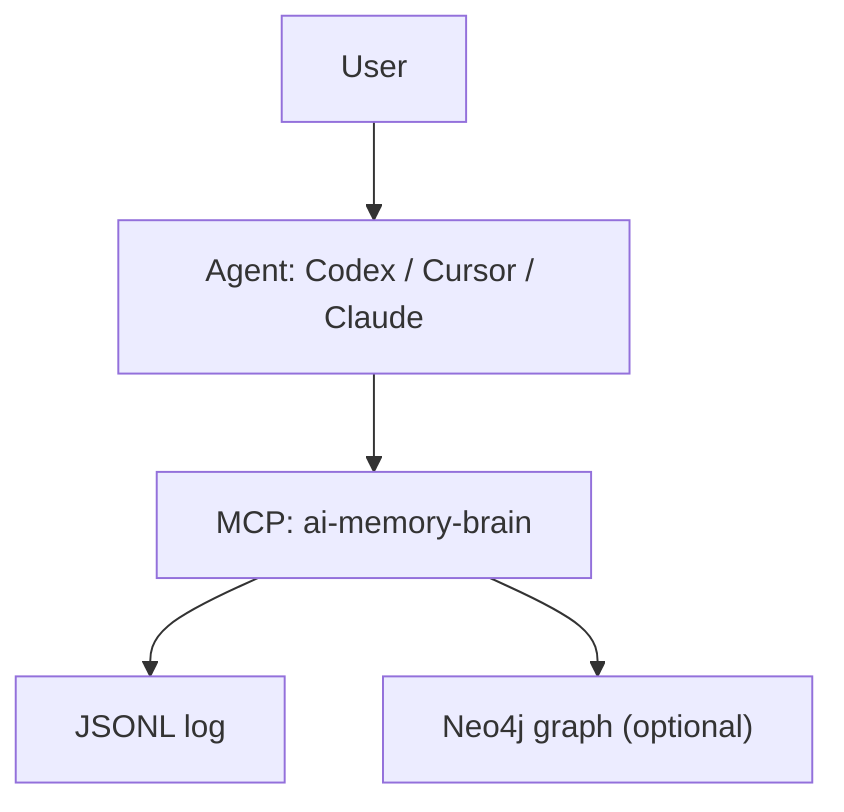
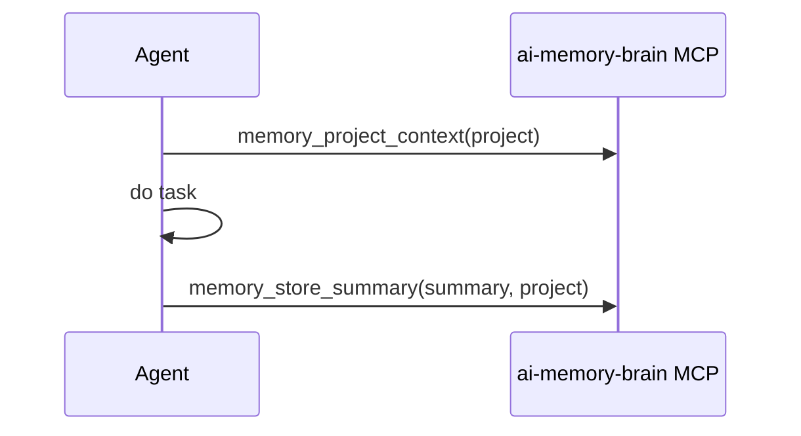

# AI Memory Brain

Local memory layer for AI agents (Codex, Cursor, Claude, Ollama clients).

## What it is
- One MCP server with memory tools (`memory_librarian/server.py`)
- Local storage in JSONL, optional Neo4j graph
- Works across projects (machine-level), not tied to one repo

## Architecture


## Modes
- **MCP-only (recommended):** no wrappers, no background daemon
- **Gateway mode (optional):** HTTP endpoint + CLI wrappers for automatic CLI capture

## Quick start (MCP-only)
```bash
cd /Users/akushniruk/home_projects/ai-memory-brain
python3 -m venv .venv-memory
source .venv-memory/bin/activate
pip install -r memory_librarian/requirements.txt
cp memory_gateway/.env.example memory_gateway/.env
```

## Connect agents

### Cursor (global)
`~/.cursor/mcp.json`
```json
{
  "mcpServers": {
    "ai-memory-brain": {
      "command": "python3",
      "args": ["/Users/akushniruk/home_projects/ai-memory-brain/memory_librarian/server.py"]
    }
  }
}
```

### Codex / Claude
Add the same MCP server entry in their MCP config.

## Recommended usage pattern


## Core tools
- `memory_recent`
- `memory_search`
- `memory_by_date` / `memory_get_date`
- `memory_project_context`
- `memory_store_summary`
- `memory_entity_context` (Neo4j)

## Verify
```bash
# local log
ls -la /Users/akushniruk/home_projects/ai-memory-brain/.run/memory

# quick tool smoke test
source /Users/akushniruk/home_projects/ai-memory-brain/.venv-memory/bin/activate
printf '%s\n%s\n' \
  '{"jsonrpc":"2.0","id":1,"method":"initialize","params":{"protocolVersion":"2025-11-25","capabilities":{},"clientInfo":{"name":"test","version":"0.0.1"}}}' \
  '{"jsonrpc":"2.0","id":2,"method":"tools/list","params":{}}' \
  | python /Users/akushniruk/home_projects/ai-memory-brain/memory_librarian/server.py
```

## Optional: Gateway mode
Use only if you want auto-capture for CLI commands.
- `memory_gateway/install-cli-wrappers.sh`
- `memory_gateway/install-launch-agent.sh`
- `memory_gateway/install-cursor-global.sh`

## Daily check-in / checkout
These are lightweight commands that write to memory without MCP UI.

```bash
source /Users/akushniruk/home_projects/ai-memory-brain/.venv-memory/bin/activate
python /Users/akushniruk/home_projects/ai-memory-brain/memory_gateway/daily_checkin.py \
  --text "Daily check-in: working on AI memory brain rules."

python /Users/akushniruk/home_projects/ai-memory-brain/memory_gateway/daily_checkout.py \
  --summary "Daily checkout:\n- Goal: ...\n- Changes made: ...\n- Decisions: ...\n- Validation: ...\n- Risks / TODO: ..."
```
